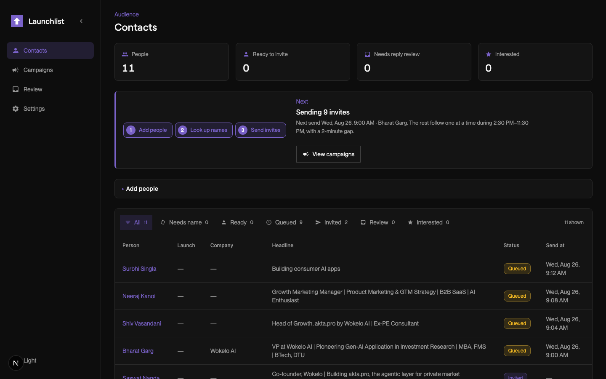
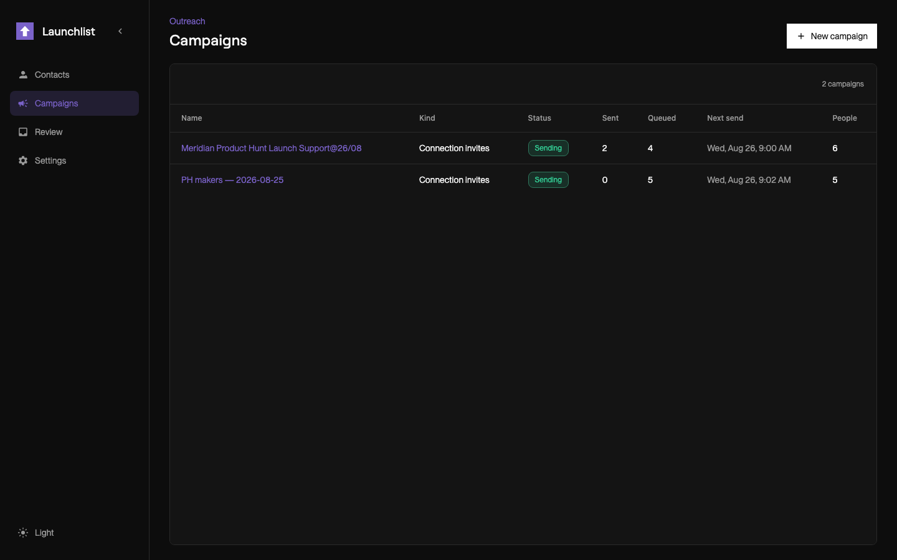
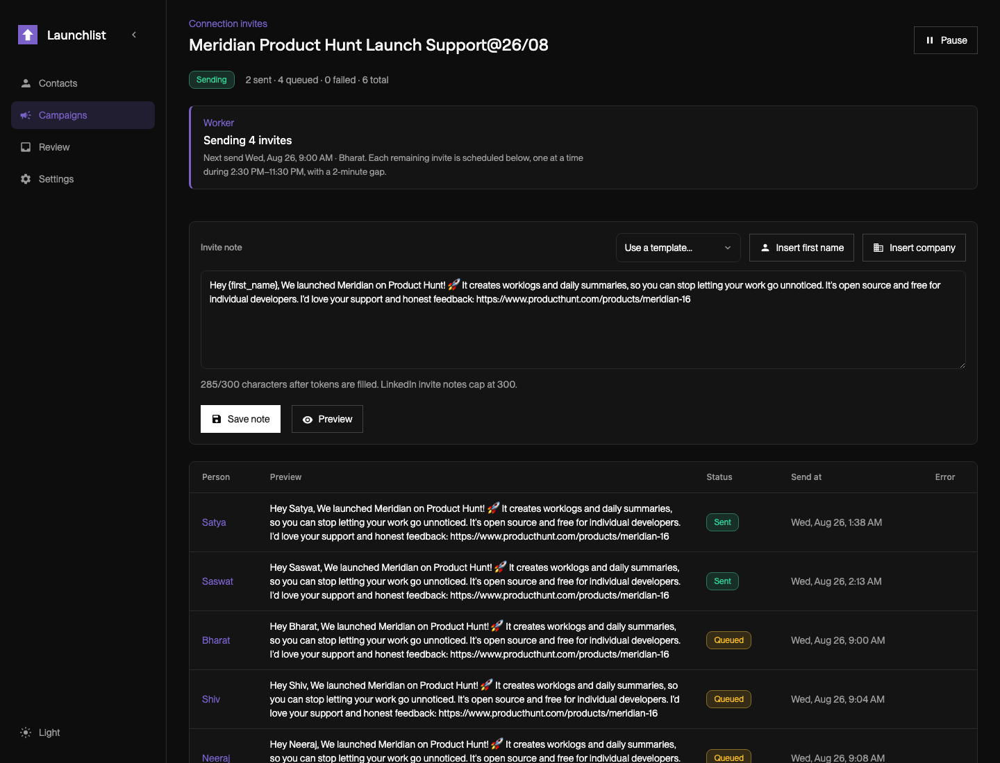
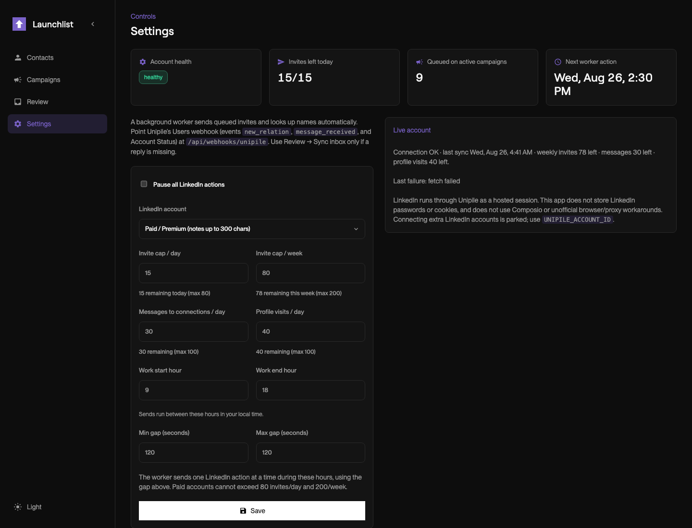
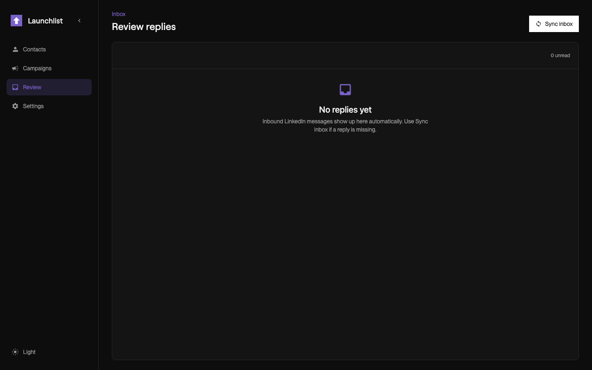

# Launchlist

A solo operator desk for Product Hunt makers → LinkedIn connection invites.

Collect today’s launches, look up names, write one note, and let the worker send invites one at a time during your local work hours.

<p>
  
</p>

## What you see

**Contacts** is the home screen: who is in the pool, who is queued, and what the worker will do next.

<p>
  
</p>

**Campaigns** are the send queue. One note covers everyone in the campaign. Status, sent, queued, and next send stay on one row.

<p>
  
</p>

Open a campaign to edit the invite note (tokens like `{first_name}`), preview the filled message, pause or resume, and see each person’s send time.

<p>
  
</p>

**Settings** is where you set daily/weekly caps, work start and end in local time, and the gap between sends. Live account health sits beside the form.

<p>
  
</p>

**Review** is the inbox. Replies land here for a human label. Sync inbox only if something is missing.

## How it runs

1. Add LinkedIn profile URLs (paste, CSV, or the daily Product Hunt collect).
2. The worker looks up first names one profile at a time.
3. You write one invite note. Tokens fill per person. LinkedIn caps notes at 300 characters (200 on free accounts).
4. The worker sends **one invite at a time** during your work hours, with the gap you set (default 2 minutes).
5. Inbound replies show up in Review.

LinkedIn goes through [Unipile](https://www.unipile.com/) as a hosted session. This app does not store LinkedIn passwords or cookies.

Daily Product Hunt collect uses [Context.dev](https://www.context.dev/) **only** to find `/in/` URLs (1 search credit per run). Name lookup is Unipile.

## Local setup

```bash
cp .env.example .env          # Unipile, Gemini, Context.dev
docker compose up -d          # Postgres
npm install
npm run db:push
npm run db:seed
npm run dev                   # http://localhost:3000
```

Optional: copy an old SQLite database with `npm run db:migrate-sqlite`.

The queue worker starts with Next.js. It sends invites, looks up names, and waits between actions.

| Env | Purpose |
|---|---|
| `DATABASE_URL` | Postgres |
| `UNIPILE_DSN`, `UNIPILE_TOKEN`, `UNIPILE_ACCOUNT_ID` | LinkedIn via Unipile |
| `GEMINI_API_KEY` | Optional. Skip inbound classification if empty |
| `CONTEXT_DEV_API_KEY` | Server-only. Search for LinkedIn URLs |
| `CRON_SECRET` | Required in production for `POST /api/queue/tick` |

Never commit `.env`. Keep secrets in Render env vars.

## Production

The app is meant to run on Render. Free instances sleep, so GitHub Actions pings `POST /api/queue/tick` every 10 minutes, weekdays 08:00–18:00 UTC, to keep the process awake.

For a paid always-on worker, run `npm run worker` as a separate process and set `DISABLE_QUEUE_WORKER=1` on the web service.

Point Unipile’s Users webhook (`new_relation`, `message_received`, Account Status) at `/api/webhooks/unipile`.
